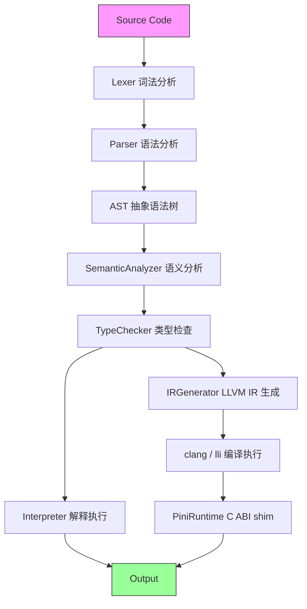

# Pini

> 一种静态类型的编程语言，采用声明与块内容交替组合的顶级结构。

Pini 是一门基于 Swift Package 实现的解释型编程语言，具有行敏感、函数体强制缩进、数据与逻辑分离（类型体字段 + 扩展块方法）等设计理念。

---

## ✨ 核心特性

| 特性 | 说明 |
|------|------|
| **静态类型** | 编译期类型检查 + 局部类型推断 |
| **顶级交替模式** | 声明态与内容态交替切换，界定块边界 |
| **函数体强制缩进** | 函数体必须缩进 ≥1 层（§A.2.3）；缩进还用于控制流子块边界 |
| **数据与逻辑分离** | 类型体（struct/object/enum）只含字段/用例；方法须写在同文件扩展块 `((T))`/`{{T}}`/`[[T]]`/`<<T>>` 并显式 `\|self`/`\|Self`（规则 3.2/3.14） |
| **显式错误传播** | 错误通过返回元组传递，而非异常抛出 |
| **异步与并发** | `=>` 标记异步函数并急切派发、`await`（异步体挂起）/ `wait`（同步阻塞）显式 join 取结果；`joinAll` 聚合、`joinWithin` 超时、`cancel` 取消、`detach` 剪枝；错误走 `ok`/`err`（errors-as-data）；GCD 真线程 + 结构化取消树（B2-1/B2-2） |
| **值/引用类型分离** | 结构块是值类型，对象块是引用类型（ARC 管理） |
| **块标签（ADR-014）** | `标签\|if`/`标签\|while`/`标签\|for` 定向 `break 标签`/`continue 标签`（旧 `scope 块标签:` 已转 reserved-error） |
| **懒加载 `LazyRef<T>`（G40，v0.42.0）** | 引用语义懒加载包装：`.value` 同步 once 获取（多线程首访仅一个线程执行初始化）、复制共享缓存；`LazyRef<T>(闭包)` / `LazyRef(闭包)` 双形态构造；解释器 + LLVM 双后端 |
| **语言级测试 `\|test` + `assert`（G41，v0.42.0）** | 测试函数块 `名称\|test()` 显式声明；`assert(条件)` / `assert(条件, 消息)` 判定；`pini test` 子命令收集执行；SwiftTesting 宿主驱动 |
| **FFI 与 unsafe（ADR-015，Phase 2a）** | `[名称\|foreign]` 块声明外部 C 函数（`malloc`/`free`/`memcpy`/`strlen`/`puts`/`cstr` 等原生函数表）；`*T` 原始指针 + C 兼容性（禁 object，ARC 隔离）；`unsafe` 消耗点 / `&` 取地址 / `\|unsafe` 自由函数；`load`/`store`/`addressof` 指针原语（解释器优先，LLVM 端 unsupported） |

> [!tip] 设计哲学
> Pini 追求**平坦编码风格**——不鼓励多重嵌套，鼓励通过类型组合和方法声明构建清晰的代码结构。

---

## 🚀 快速开始

### 环境要求

- Swift 5.9+
- macOS 12+ 或 Linux

### 构建项目

```bash
cd Pini
# 项目位于外置卷（如 /Volumes/*）时 SwiftPM 沙箱不可用，需禁用沙箱：
swift build --disable-sandbox
# 本地磁盘可直接 swift build
```

### 运行你的第一个程序

创建 `hello.pini`：

```pini
main|func() -> ()
    print("Hello, Pini!")
    return
```

运行：

```bash
swift run pini run hello.pini
```

> [!success] 预期输出
> ```
> Hello, Pini!
> ```

---

## 📖 CLI 命令参考

### 命令一览

| 命令 | 功能 | 用法 |
|------|------|------|
| `run` | 执行程序（解释器） | `pini run <path>` |
| `check` | 类型检查 | `pini check <path>` |
| `build` | 类型检查（check 别名） | `pini build <path>` |
| `test` | 运行 `\|test` 测试块（G41） | `pini test <file.pini>` |
| `parse` | 打印 AST | `pini parse <file.pini>` |
| `tokens` | 打印词法单元 | `pini tokens <file.pini>` |
| `emit` | 生成 LLVM IR | `pini emit <file.pini> [-o out.ll]` |
| `compile` | 经 clang 编译并运行（LLVM） | `pini compile <file.pini>` |
| `run-llvm` | 经 lli JIT 运行（LLVM） | `pini run-llvm <file.pini>` |
| `lsp` | 启动 LSP 服务器 | `pini lsp` |
| `debug` | 源码级调试器 | `pini debug <path>` |
| `dap` | DAP 调试适配器 | `pini dap <path>` |
| `repl` | 交互式 REPL 会话 | `pini repl` |
| `help` | 显示帮助 | `pini help` |
| `version` | 显示版本 | `pini version` |

> `emit`/`compile`/`run-llvm` 需要 LLVM 工具链（`clang`/`lli`，或设置 `PINI_LLVM_BIN`）；纯解释器执行始终用 `pini run`。

### 调用方式

> [!info] Swift Package 调用方式
> 在开发阶段，推荐使用 `swift run` 直接运行，无需手动构建。

**方式一：swift run（推荐）**

```bash
swift run pini run hello.pini
swift run pini check hello.pini
swift run pini parse hello.pini
swift run pini tokens hello.pini
```

**方式二：构建后直接调用**

```bash
swift build --disable-sandbox   # 外置卷需禁沙箱，本地磁盘可省
.build/debug/pini run hello.pini
```

**方式三：安装到系统**

```bash
swift build -c release --disable-sandbox   # 外置卷需禁沙箱
cp .build/release/pini /usr/local/bin/pini
pini run hello.pini
```

---

## 🧱 语言基础

### 变量声明

```pini
var 计数: I32 = 0          ; 可变变量
let 常量 = 42              ; 不可变变量，类型推断为 I32
```

### 函数声明

```pini
加法|func(a: I32, b: I32) -> (I32,)
    return a + b
```

### 结构块 + 扩展块（数据与逻辑分离，规则 3.2/3.14）

```pini
(点)
x: F64 = 0.0
y: F64 = 0.0

((点))
距离原点|self() -> (F64,)
    return sqrt(x * x + y * y)
```

### 对象块（引用类型）——方法在 `{{T}}` 扩展块

```pini
{计数对象}
数值: I32 = 0

{{计数对象}}
递增|self() -> ()
    self.数值 = self.数值 + 1
    return
```

### 控制流

```pini
main|func() -> ()
    var i = 0
    while i < 10:
        if i % 2 == 0:
            print(i)
        i += 1
    return
```

### 带标签控制流（ADR-014）

```pini
main|func() -> ()
    outer|while true:
        while true:
            break outer
    print("done")
    return
```

### FFI 与 unsafe（Phase 2a，解释器优先）

```pini
[libc|foreign]
malloc(size: U64,) -> (*U8,)
free(p: *U8,) -> ()
strlen(s: *U8,) -> (U64,)
cstr(s: String,) -> (*U8,)

main|func() -> ()
    var s = unsafe cstr("hello")
    print(unsafe strlen(s))
    unsafe free(s)
    return
```

> [!note] 缩进规则
> 函数体必须缩进 ≥1 层（`main\|func` 的语句写在 `    ` 之后）；缩进还标识**控制流子块**（if/while/match/try）的边界。类型体（字段/用例）与方法签名顶格书写，方法体缩进。

---

## 🏗️ 项目架构



> 双后端：解释器（`pini run`，始终可用）与 LLVM 后端（`emit`/`compile`/`run-llvm`，需 LLVM 工具链；运行时经 `PiniRuntime` 动态库 C ABI shim 提供服务）。`RuntimeBackendTests` 保证两后端逐字节一致。

### 目录结构

```
Pini/
├── Package.swift
├── Sources/
│   ├── PiniCLI/           # 命令行入口（含 REPL、LSP、调试器/DAP）
│   ├── PiniCore/          # 核心库
│   │   ├── Lexer/            # 词法分析
│   │   ├── AST/              # 抽象语法树
│   │   ├── Parser/           # 语法分析
│   │   ├── Semantic/         # 语义分析
│   │   ├── Type/             # 类型系统
│   │   ├── Interpreter/      # 解释器（含 SuspendScheduler 并发运行时）
│   │   ├── CodeGen/          # LLVM IR 生成（含 RuntimeBackendTests 契约）
│   │   ├── LSP/              # 语言服务器
│   │   ├── Debugger/         # 源码级调试器 / DAP
│   │   └── Common/           # 公共组件
│   └── PiniRuntime/       # LLVM 后端运行时 C ABI shim（libPiniRuntime）
└── Tests/
    ├── PiniTests/         # XCTest 测试（解释器 + LLVM + 示例门禁）
    └── PiniSwiftTests/    # SwiftTesting 宿主测试（.pini |test 端到端）
```

---

## 🧪 运行测试

```bash
swift test
```

> [!example] 测试覆盖范围
> - 词法/语法/类型/语义/解释器测试（`PiniTests`）
> - **LLVM 后端与运行时契约测试**：`RuntimeBackendTests`（解释器 / `lli`-JIT / `clang`-AOT 三执行路径锁步）
> - **示例门禁**：`ExamplesConformanceTests` / `ExamplesRunTests`（`examples/*.pini` 全绿，破坏示例 `check` 的改动视为未通过）
> - **SwiftTesting 宿主测试**（`PiniSwiftTests`）：驱动 `.pini` `|test` 函数块端到端

---

## 📚 相关文档

> 语言级文档（规范/项目规范/注释风格/术语/ADR/路线图/诊断码/测试规范/CHANGELOG）已迁移至 **pini-meta** 仓库（语言级治理单一事实源，2026-08-28，见 ADR-018）。本仓库 docs/ 仅保留实现级文档。

- pini-meta 仓库：pini-spec-v0.md（权威语言规范，单一事实源；**形式文法 EBNF 在 spec 附录**，唯一载体）／ pini-project-spec.md（项目目录结构约定）／ pini-comment-style-guide.md（注释风格，spec §7 治理）／ pini-glossary.toml（中英术语表）／ adr-index.md（ADR 登记表）／ pini-roadmap-next.md（演进路线图）／ diagnostic-codes.md（诊断码表，派生视图）／ test-refactoring-principles.md（测试规范，spec §6 治理）／ CHANGELOG.md（版本演进史）
- 本仓库 docs/：issue-ffi-module-2026-08-27.md（实现级记录）

---

## ⚠️ 已知限制

> [!warning] 当前版本限制
> - **LLVM 后端（P6）**：已交付。`emit`/`compile`/`run-llvm` 可生成并运行 LLVM IR，但需本机安装 LLVM 工具链（`clang`/`lli`，或设置 `PINI_LLVM_BIN`）。纯解释器执行请用 `pini run`（始终可用，无需 LLVM）。`LazyRef.valueFuture` 已抛弃（仅同步 `.value`）。**FFI/unsafe 构造（`foreign` 块/`*T`/`&`/`unsafe`）在 LLVM 端显式 unsupported**——请用 `pini run`（用户决策 D1，解释器优先）。
> - **模式匹配**：已支持枚举关联值绑定与元组/多返回值 `match`（`case` 子块缩进 + `case _:` 通配）；`try`/`catch` 不在语言中（错误经 `return ok/err` + `match ok/err` 收口）。
> - **迭代（v0.39.0+）**：`for-in` 已实现（spec G36）——`for (模式元组,) in 集合值:`，支持 `step:` 与 `标签\|for`（ADR-014）；`while + len()` 仍可用。
> - **块标签（ADR-014，v0.48.1）**：`标签\|if`/`标签\|while`/`标签\|for` 模型——`break 标签` / `continue 标签` 按标签名定向（无 sigil）；旧 `scope 块标签:` 已转 reserved-error；`#` 文档注释（行首到行尾，与 `;` 行注释并存）。
> - **继承**：当前无继承语法（方法沿继承链静态校验已移出 P3，单列排期）。
> - **异步并发（G12，Provisional）**：`=>`/`await`/`wait`/`joinAll`/`joinWithin`/`cancel`/`isCancel`/`detach` 已实现（立场 B：GCD 真线程 + `Future` 结构化取消树 + `joinAll` fail-fast）。错误经 `ok`/`err` 返回，`CancelError` 表示取消。**`await`（异步体挂起）/ `wait`（同步阻塞 join）已落地**：suspend 模式经自建续体运行时（`SuspendScheduler`，纯 Swift 5.9）真正挂起、释放 OS 线程、精确恢复；默认同步/阻塞 join 路径不变，`joinWithin` 仍为带超时阻塞 join。跨平台后端与自举纯 libc 为规划方向（长期愿景见 spec）。
> - **测试（v0.42.0）**：`\|test` 函数块 + `assert` 内建 + `pini test` 已落地；`.valueFuture` 已抛弃。
> - **FFI（ADR-015，Phase 2a，Experimental）**：解释器端已落地——`foreign` 块经预注册原生函数表（`malloc`/`free`/`memcpy`/`memset`/`strlen`/`puts`/`strcmp`/`cstr`）解析，未注册函数注册期报错；`&` 为**快照取址**（写回不更新原变量，与 LLVM 端真引用语义不同）；dlsym 动态符号解析与 LLVM 端 FFI 为后续阶段。见 `examples/ffi.pini`。

更多待完善特性与已知缺口见 pini-meta 仓库的 Pini 不完善规范 v0（语言级文档已迁移至 pini-meta，见上方相关文档）。

---

## 📄 License

MIT License
